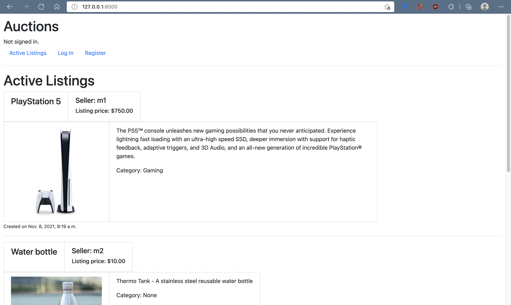
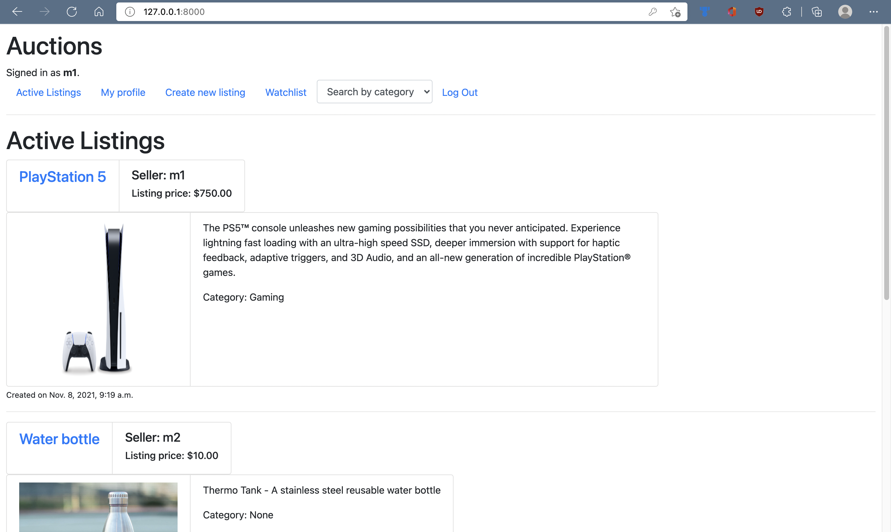
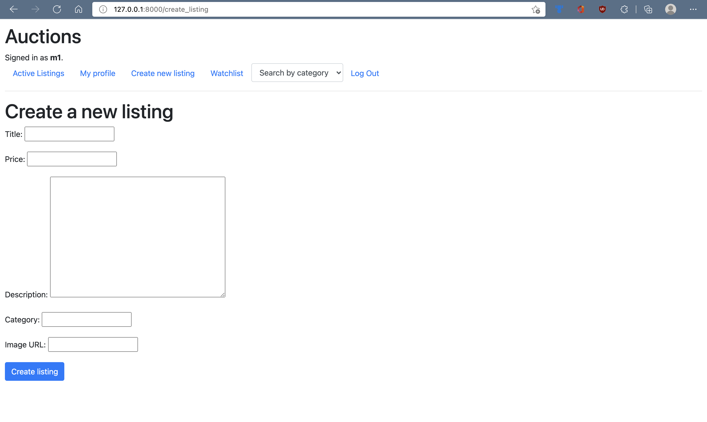
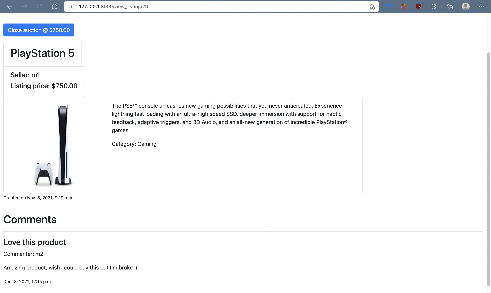
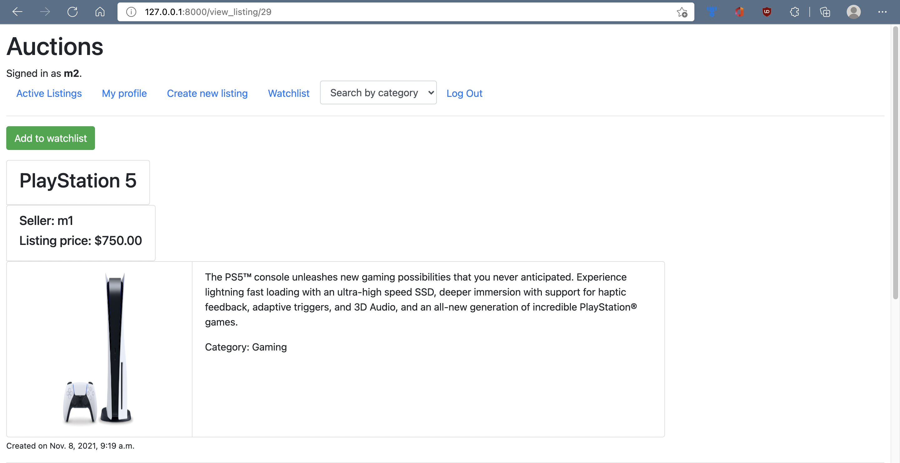
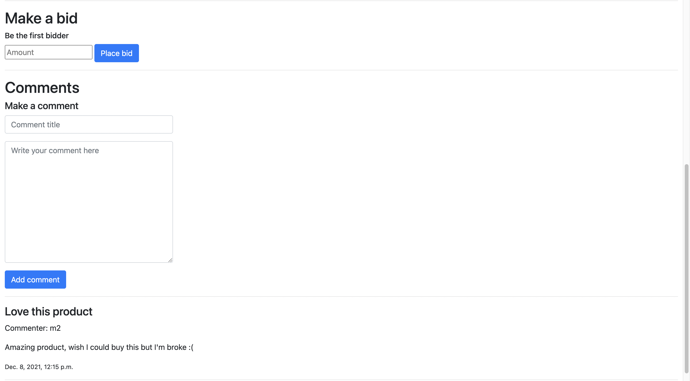
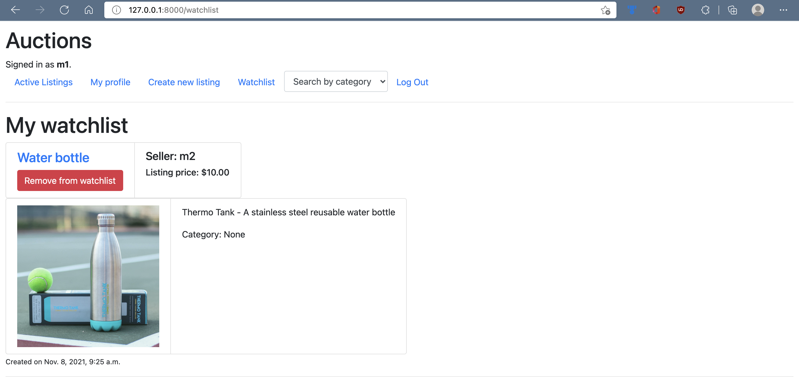
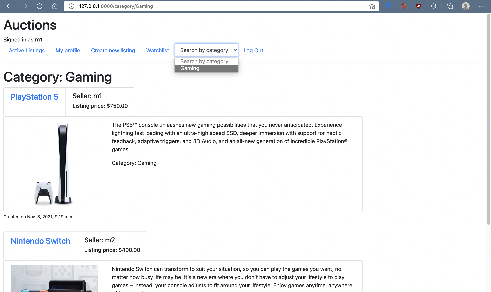
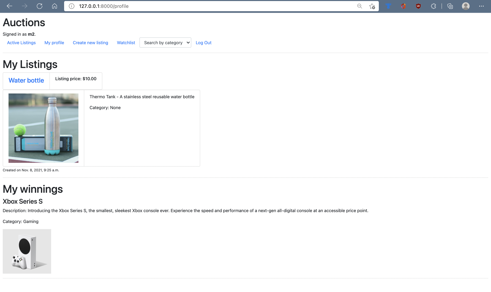

# Commerce
A full stack Django web application designed as an e-commerce auction website with functionality such as:
- User authentication
- Posting auction items
- Placing bids on items
- Commenting on listings
- Adding items to a watchlist

This is project 2 of the online course [CS50 Web](https://cs50.harvard.edu/web/2020/).

# Project goals
- Learning Django
- Create full stack web application
- Understanding & implementing Django models and migrations
- Creating relationships amongst tables (Django models)

# Index
The index page displays a list of all active auctions. Initially, the auctions cannot be viewed in full detail until the user is logged in, so an account must be created to get access to all the features of the application.

Index page when user is not logged in:

Index page when user is logged in:

**The features to be explained below all require the user to be logged in.**
# Creating an auction
You can create your own auction and have it displayed in the active listings page. The image and category field are optional, while the other fields are required.

Form for creating a listing: 

# Viewing an auction
You can click on an auction item to view full details about the item, including the item details, initial listing price, current bid price, and comments, if there are any.

If the seller of the item visits the auction page, they can choose to close the auction at the current price.

Otherwise, if a potential buyer visits the auction page, that user can add the auction to their watchlist, make a bid on the item, or add a public comment.

Visiting an auction as the seller:

Visiting an auction as a buyer:

# Watchlist
A user can items add to and remove items from their watchlist.

# Search by category
Active listings can be filtered by category using the "Search by category" select menu.

A filtered search for items in the "gaming" category would look like this:

# Profile
Users can check their own profile, which includes auctions they have listed and auctions that they have won.

